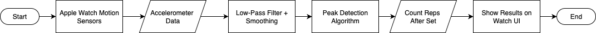

# 🏋️‍♂️ Core Motion Rep Counter  

This project is an **Apple Watch app** that uses **Core Motion** to automatically count exercise repetitions.  
It streams data from the watch's accelerometer in real time, applies a **live peak detection algorithm**,  
and counts reps after each completed set.  

## 📸 Preview  

### 🧾 Flowchart  

### 🎥 Set-Based Counting  

### 📡 Live Detection  

## 📱 Features  

- 📊 **Real-time motion data** streaming from Apple Watch  
- 📈 **Live rep detection** with peak analysis  
- ⏱️ **Set-based counting** – reps are recorded after you complete a set  
- 👀 **Visual feedback** on the watch screen  
- 🏋️ Designed for **gym movements** like curls, presses, and squats  

## 🛠️ Tech Stack  

- **SwiftUI** – clean & reactive user interface  
- **Core Motion** – access to accelerometer & gyroscope data  
- **Combine** – observe and process motion updates in real time  

## 🚀 How It Works  

1. The watch continuously collects **motion data** (accelerometer + gyroscope).  
2. A **peak detection algorithm** detects reps as you move.  
3. After a set is completed, the watch **finalizes rep count** based on detected peaks.  
4. The result is displayed **live** on your watch.  

## 🧠 Learning Journey  

I approached this project by:  
- 🔍 Breaking the problem into **small, testable steps**  
- 📚 Researching **Core Motion** and **peak detection** using Apple Docs & forums  
- ⌚ Testing directly on my **Apple Watch** until the detection felt accurate  

## 🔮 Next Steps  

- 🏷️ Add support for **multiple exercise types**  
- 🔧 Improve **noise filtering** to avoid false counts  
- 📊 Store results in **HealthKit** for progress tracking  
- 🎨 Create a more detailed **visual dashboard** for workouts  

---

💡 *This project was a hands-on way to learn about Core Motion, data smoothing, and real-time sensor processing on watchOS.*
